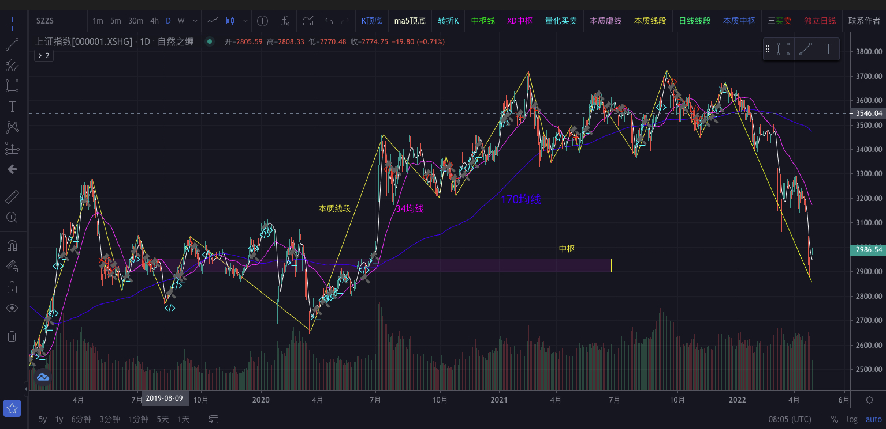
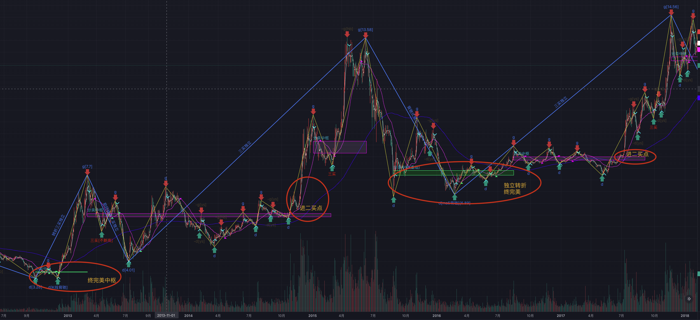

基于TradingView本地SDK的可视化前后端代码，适用于缠论量化研究，和其他的基于几何交易的量化研究。

## 参考文章
[正式开源！适用于缠论量化研究，基于TradingView本地SDK的可视化前后端代码](https://mp.weixin.qq.com/s/5NxteND3hS5qcH2Jkuy2eQ)

[作为交易者，TradingView你想知道的一些点](https://mp.weixin.qq.com/s?__biz=MzI2NzExMTA4NA==&mid=2650090885&idx=1&sn=30eba518ae79d887e052499089d583e7&chksm=f2825246c5f5db50d174f692abb4e1dd3f5e4694b89ed181172f903387d79c01461036c89bd1&token=286592241&lang=zh_CN#rd)

## 【More缠量化研习】圈子


## [ZaW系列]文章


[​[ZaW系列]-003-市场的语言](https://mp.weixin.qq.com/s/X9hcZ2nfn2xTVHXpswHTnQ)

[[ZaW系列]-002-本地tv秒级K及买点](https://mp.weixin.qq.com/s?__biz=MzI2NzExMTA4NA==&mid=2650091144&idx=1&sn=553e94204ced2cd815b119ef65cf980e&chksm=f282514bc5f5d85d5ec5147827030f6b7c2384f9f62e5dc574cda77244b63ee5a4e3d10d6d2a&token=2128197253&lang=zh_CN#rd)

[[ZaW系列]-001-小试期货](https://mp.weixin.qq.com/s?__biz=MzI2NzExMTA4NA==&mid=2650091132&idx=1&sn=96eb341a4821154acd5fee8ea59816e7&chksm=f28251bfc5f5d8a941fe91a6673f50178219a3decbb195f012827ee84dc660738cdf827639ab&token=2128197253&lang=zh_CN#rd)


## 摩尔缠论相关文章

[本心缠论，一个更纯粹的缠论体系(4)-流派与残本](https://mp.weixin.qq.com/s?__biz=MzI2NzExMTA4NA==&mid=2650091062&idx=1&sn=00cc13b375dbe3df28c85abc4963dee9&chksm=f28251f5c5f5d8e3ed820bb140331c7d3eac3e3fcb7d354b75f89f03c085f760304e3f9a0f6c&token=302693295&lang=zh_CN#rd)

[本心缠论，一个更纯粹的缠论体系(3)-那一个买点](https://mp.weixin.qq.com/s?__biz=MzI2NzExMTA4NA==&mid=2650091045&idx=1&sn=78beac5627d35ea89bab981cc469f6eb&chksm=f28251e6c5f5d8f091fac1e2ba1ece42fb612cd83c5e57ed029ee25921fbb52e01088e76e8a6&token=827136753&lang=zh_CN#rd)

[本心缠论，一个更纯粹的缠论体系(2)-学缠四依法](https://mp.weixin.qq.com/s?__biz=MzI2NzExMTA4NA==&mid=2650091024&idx=1&sn=cb853e3b8e46af48f625c256b2a8fca5&chksm=f28251d3c5f5d8c520632199b97023fcfd80be165eac376dd01b1e942991e6ad28e379dc2643&token=827136753&lang=zh_CN#rd)

[本心缠论，一个更纯粹的缠论体系(1)-破量化的执念](https://mp.weixin.qq.com/s?__biz=MzI2NzExMTA4NA==&mid=2650091013&idx=1&sn=5e4ea7d22af9247ddc1ae93a2a0aac0d&chksm=f28251c6c5f5d8d059d139de7acf90f3085d3593b2375882a8aee31577b95bb4b87d7c109c39&token=1365295420&lang=zh_CN#rd)

-------

[摩尔缠论，一个伟大的缠论分支体系(14)-市场最大的坑](https://mp.weixin.qq.com/s/7yqO3MU3YJuz-0U_vkW1fA)

[摩尔缠论，一个伟大的缠论分支体系(13)-均线与缠论](https://mp.weixin.qq.com/s?__biz=MzI2NzExMTA4NA==&mid=2650090989&idx=1&sn=2ee71bd881211ff9aecc9843581d45a6&chksm=f282522ec5f5db386986abb6178b355dcc89cf4a08f78d3f2db6554d7c2d00626089df408260&token=1365295420&lang=zh_CN#rd)

[摩尔缠论，一个伟大的缠论分支体系(12)-本质中枢](https://mp.weixin.qq.com/s?__biz=MzI2NzExMTA4NA==&mid=2650090980&idx=1&sn=87a38f3010d86eabcb91f22754df1b0b&chksm=f2825227c5f5db312c099d3fd6523c93df1ea93492b918513ac1fbe8c931b768806fdd842527&token=1365295420&lang=zh_CN#rd)

[摩尔缠论，一个伟大的缠论分支体系(11)-本质线段](https://mp.weixin.qq.com/s?__biz=MzI2NzExMTA4NA==&mid=2650090969&idx=1&sn=5793f84317fe40781e339ff1ada452b9&chksm=f282521ac5f5db0ca575f52f91ffa5a7b07151e97321b98cc58300990904288206d75673d7b8&token=1365295420&lang=zh_CN#rd)

[摩尔缠论，一个伟大的缠论分支体系(十)-知识体系概览](https://mp.weixin.qq.com/s?__biz=MzI2NzExMTA4NA==&mid=2650090960&idx=1&sn=a2381dff4083e5244f2aeb4bca392484&chksm=f2825213c5f5db05b7ca1d84ef194f2c9f9ecba71ed7b28406a5a75d1bdb0fd41941ff30d190&token=1365295420&lang=zh_CN#rd)

[摩尔缠论，一个伟大的缠论分支体系(九)-周线升级独立](https://mp.weixin.qq.com/s?__biz=MzI2NzExMTA4NA==&mid=2650090949&idx=1&sn=d91119a7222646d66d8135bccba429fe&chksm=f2825206c5f5db1038953c132549df049855e3c74178bfaef034470b558361d5cce8a70d06f5&token=1365295420&lang=zh_CN#rd)

[摩尔缠论，一个伟大的缠论分支体系(八)](https://mp.weixin.qq.com/s?__biz=MzI2NzExMTA4NA==&mid=2650090932&idx=1&sn=a11ab6186b78b4d93f8328eb8b8398de&chksm=f2825277c5f5db6121b7cd87bc674ae1241c2ddec1a4eb49f165b334ecd1c8dc4e52a70e82e0&token=1365295420&lang=zh_CN#rd)

[摩尔缠论，一个伟大的缠论分支体系(七)](https://mp.weixin.qq.com/s?__biz=MzI2NzExMTA4NA==&mid=2650090915&idx=1&sn=95ec8bd6a45c9c3a5213ba1c40d3bae1&chksm=f2825260c5f5db761ae67a98aa869f6805a906d9fe3565358ce5b37ae5d2f5e5c8d75e0af4b8&token=1365295420&lang=zh_CN#rd)

[摩尔缠论，一个伟大的缠论分支体系(六)](https://mp.weixin.qq.com/s?__biz=MzI2NzExMTA4NA==&mid=2650090894&idx=1&sn=793d59de7337468c408d64750169dad9&chksm=f282524dc5f5db5b5161d96e32f05a467904f2188ad05b2f2b805a1e0d651a76728af7b1d7f2&token=1365295420&lang=zh_CN#rd)

[摩尔缠论，一个伟大的缠论分支体系(五)](https://mp.weixin.qq.com/s?__biz=MzI2NzExMTA4NA==&mid=2650090876&idx=1&sn=4eb590372cded649b954c2e385413997&chksm=f28252bfc5f5dba984d7f9895e8ff150f78be61fe0dd9c4cafd918ff9b16ffd789dfaee62e39&token=1327530731&lang=zh_CN#rd)

[摩尔缠论，一个伟大的缠论分支体系(四)](https://mp.weixin.qq.com/s?__biz=MzI2NzExMTA4NA==&mid=2650090841&idx=1&sn=3e026f3fc9ea34e3354b3b2d6ed61124&chksm=f282529ac5f5db8cd861d692b971cb4a60d894c99fab908e2eeffd5e28087ebacfdd1d2b0378&token=1199670747&lang=zh_CN#rd)

[摩尔缠论，一个伟大的缠论分支体系(三)](https://mp.weixin.qq.com/s?__biz=MzI2NzExMTA4NA==&mid=2650090828&idx=1&sn=571a02aff3a8dec4b68522ade3f64aa2&chksm=f282528fc5f5db99ca6bb04a1ec559e5d23ebfc7d833e555a7f2f789047010cb1dabc47a1d67&token=1199670747&lang=zh_CN#rd)

[摩尔缠论，一个伟大的缠论分支体系(二)](https://mp.weixin.qq.com/s?__biz=MzI2NzExMTA4NA==&mid=2650090812&idx=1&sn=448214fc48c368d3b7190abb9b975536&chksm=f28252ffc5f5dbe9903406ec7157f7f7807dc5562359fd037438303486e7ad933ea8ea766879&token=1199670747&lang=zh_CN#rd)

[摩尔缠论，一个伟大的缠论分支体系(一)](https://mp.weixin.qq.com/s?__biz=MzI2NzExMTA4NA==&mid=2650090801&idx=1&sn=08ede867ceb519f8a18e90970ce452ac&chksm=f28252f2c5f5dbe4e2c1e3f430d19e04e8434b62cd62d0abed69f92ec104acc85be9e4c220ee&token=1199670747&lang=zh_CN#rd)

## 缠论思考与量化

[缠论版《神雕侠侣》主题曲《天下有情[钱]人》第一版](https://mp.weixin.qq.com/s?__biz=MzI2NzExMTA4NA==&mid=2650090795&idx=1&sn=69db18dc36d47724d76c02f4491b9f82&chksm=f28252e8c5f5dbfe80b8f392300e785617d0e79a0aa79d567e1abd4ac8878113e94afc60135a&token=1199670747&lang=zh_CN#rd)

[从丁元英的诗词中，悟缠论量化的历程](https://mp.weixin.qq.com/s?__biz=MzI2NzExMTA4NA==&mid=2650090853&idx=1&sn=bfebe4e4e2c39e213fc3483cd060dca6&chksm=f28252a6c5f5dbb03237431544fd99c89aee5a1dadca76306a9e9ea34b4818973f1e2b2f1647&token=1199670747&lang=zh_CN#rd)

## 大盘效果图


## 个股效果图(最新:2022-08-30)


## 亮点
* 基于全世界乃至全宇宙最好的K线分析工具:TradingView；
* 没有画图数量的限制，可画任意的形态图形；
* 可以本地部署，或者云平台私有部署；
* 前后端完全分离，前端基于国产的Vue来实现；
* 与缠论的分析逻辑完全分离，策略提供的识别结果，通过api做可视化；
* 没有数据限制的逐K回放（待添加）；


## 架构体系
1. 使用TradingView的本地SDK做可视化，支持本地或者云平台部署。
1. 前端使用vue和typescript来实现的画图的功能和接口。
2. 后端使用Python的Web框架Flask，提供api接口。
3. 使用MongoDB来存储K线的历史数据，缠论识别出来的结构数据。


## 功能点
1. 实现了在TradingView的界面上，自定义按钮（button)，实现画笔、线段、中枢的功能；
2. 实现了自定义指标的功能点；
3. 完美的继承了在线TradingView的大部分功能（因为sdk版本的功能，要落后与在线的版本一点）；
4. 没有画图数量的限制；
5. 可以完全的自定义各种数据点，实现自己的千人千缠的需求；
6. 可以保存画的图，后续加载使用（暂未添加，可以直接使用TV官方的一个代码：https://github.com/tradingview/saveload_backend，基于Django和Postgresql实现）；
7. 实现逐K回放的功能（使用较复杂，暂未添加）；

## 目录结构说明
```bash
├── README.md
├── api               # API目录
│   ├── chanapi.py    # 核心的接口代码
│   ├── requirements.txt  # python的包依赖
│   ├── symbol_info.py    # 加载票的名字，开源通过TV界面搜索
├── comm
│   ├── __init__.py
│   └── conf.py       # 配置信息
├── data              # mongodb的数据，使用后面的：hetl/hmongo/restore_chanvis_mongo.sh 导入本目录的数据
│   ├── config
│   ├── nlchan
│   └── stock
├── hetl             # K线history 的 ETL相关
│   ├── hmgo         # mongo数据库相关
│   ├── selcoin      # 选币相关
│   └── stock        # 股票相关
├── pics             # 图片目录
│   └── sz000001.jpg
├── ui
│   ├── README.md     # 说明，安装npm的库，启动
│   ├── package.json  # 库的版本
│   ├── public        # 需要把官方的charting_library/和datafeeds/目录复制到此处
│   ├── src           # 前端源代码，主要是：src/components/ChanContainer.vue
└── utils
    ├── __init__.py
    ├── dtlib.py      # 日期相关的辅助函数
    └── nlchan.py     # naturalchan相关的辅助函数
```

## 已知bug
1. 本程序已发现一些bug，就是目前是全量画线的功能，当K线还没有加载出来的时候，画线就会画在边框，形成一条难看的线。刷新整个页面再来吧。
2. 本人主要做数据挖掘，使用Python。并不熟悉前端，包括vue和js，全是用到一点去搜索一点，因此代码仅供参考。
3. 当然，非常欢迎专业前端参与贡献，这样好多想法应该都可以实现。

## 缠论说明

本代码目前提供了一个可用的demo系统，可以按自己的需求，来参照里面的部分实现，去完成每个人自己的缠论量化的伟大的事业，去实现自己的千人千缠的可视化。

本人目前走的是缠论的一个小众分支--摩尔缠论，demo里面提供的示例数据也是通过这个策略来实现的，各位只需要参考里面的数据结构、接口、可视化等的实现方式，再根据自己的需求，去优化自己的代码即可。

demo的数据的准确性，各位也不要太在意，这块是我目前还需要不断完善的点，也是我接下来的重点。一个完美的结构，是需要大量的时间去优化和实现的。

本开源的代码，不具有量化策略的功能，也不具备回测等功能，其目的只是提供一个几何分析的可视化工具而已，期望不要太高。

如果对以缠论为代表的几何交易的程序化实现和可视化有需求，也不要期望太低，基于TV的可视化，会给你不一样的体验。

## 联系作者

欢迎对缠论量化有兴趣的伙伴，一起讨论，去实现那完美的几何结构！尤其欢迎一起讨论和共同学习【摩尔缠论】。

加好友请备注：自然之缠 （否则不予通过）。


